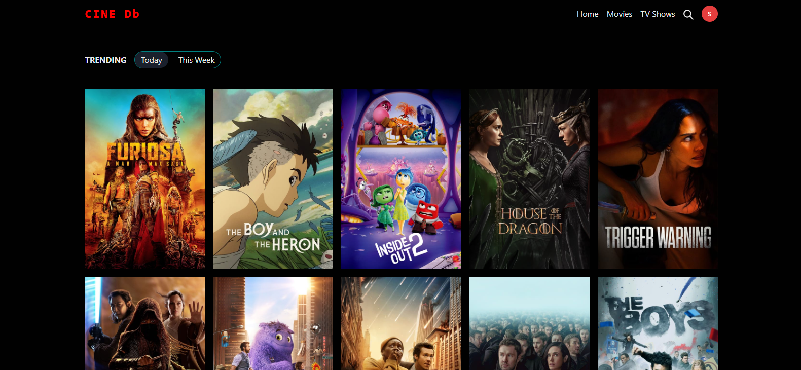
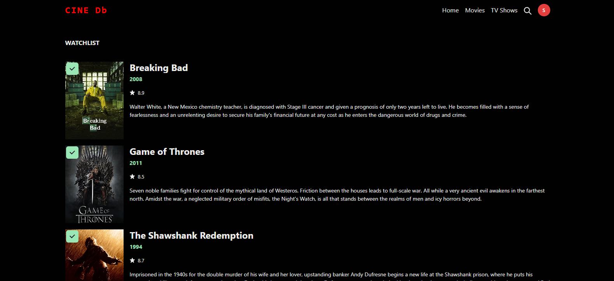
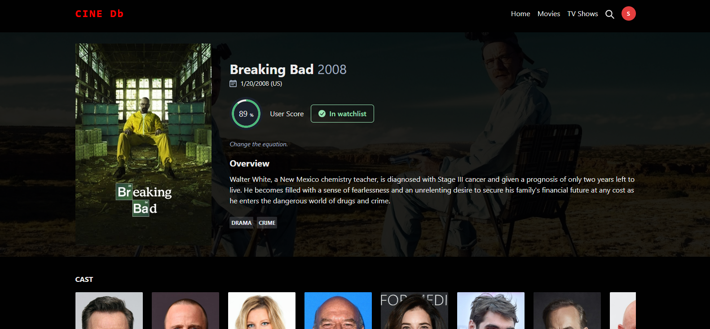
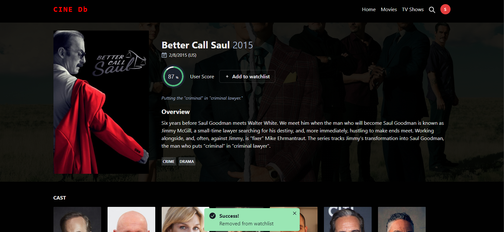

# Cine Db

## Description

The idea of this project has been inspired by [IMDb](https://www.imdb.com/). Database that have been used to make the API calls is The Movie Database (TMDB). It provides movie data in a very structured format. I have learned about various applications of React.js and Restful APIs. 

Project hosted live: https://cine-db.vercel.app/

## Technologies used

- React
- Firebase
- Chakra UI
- TMDB API [Learn more about TMDB](https://www.themoviedb.org)

## Demo User Interfaces
* UI for fetching movies from the database.

* Saving movies and tv shows to your watchlist.

* UI for showing details for specific movie.

* Removing a movie from your watchlist.

